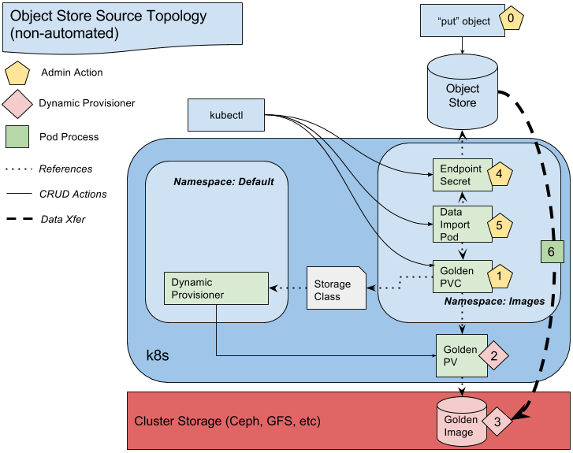
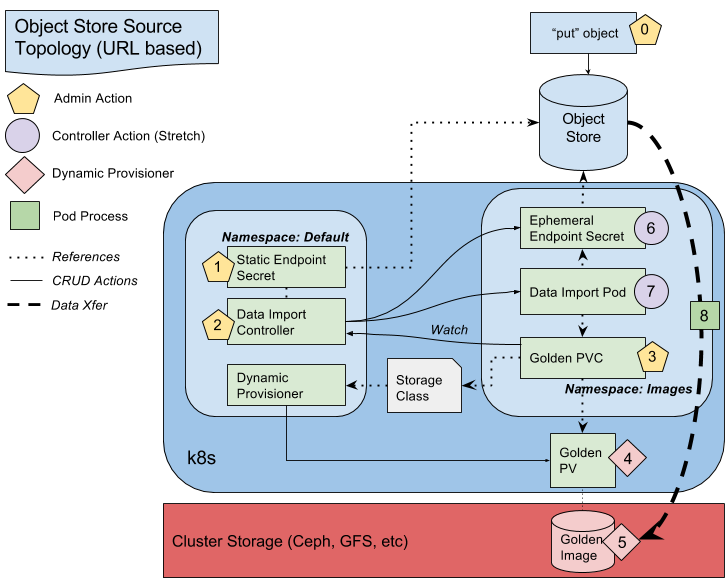

# VM Import Controller
This repo implements a vm image importer (copier) to a known location inside a Kubernetes or Openshift cluster. This immutable vm image copy is considered a _golden image_ source for later vm cloning and instantiation.

## Purpose

The project eases the burden on cluster admins seeking to take advantage
of Kubernetes orchestration for their virtualized app platforms.  As a first
step in migration into a Kubernetes cluster, virtual machine images must
be imported into a location accessible to the kubelet.  The VM Importer
automates this by pulling images from an external http repository and preserving
them in in-cluster storage.  The components of this process are detailed below.

## Design (Current)


## Components (Current):
**Object Store:** Arbitrary url-based storage location.  Currently we support
http and S3 protocols.

**Images Namespace:** Restricted/private Namespace for Golden Persistent
Volume Claims. Data Importer Pod and it’s Endpoint Secret reside in this namespace.

**Dynamic Provisioner:** Existing storage provisoner(s) which create
the Golden Persistent Volume that reference an empty cluster storage volume.
Creation begins automatically when the Golden PVC is created by an admin.

**Golden PV:** Long-lived Persistent Volume created by the Dynamic Provisioner and
written to by the Data Import Pod.  References the Golden Image volume in storage.


**Golden PVC:** Long-lived claim manually created by an admin in the Images namespace.
Linked to the Dynamic Provisioner via a reference to the storage class and automatically
bound to a dynamically created Golden PV.

**Storage Class:** Long-lived, manually created Storage Class(es) which link Persistent
Volume Claims to dynamic provisioner(s). Referenced by the golden PVC.

**Endpoint Secret:** Short-lived secret in Images Namespace that must be defined
and created by an admin.  The Secret must contain the url, object path (bucket/object),
access key id and secret key required to make requests from the store.  The Secret
is mounted by the Data Import Pod


**Data Import Pod:** Short-lived Pod in Images Namespace.  The Pod Spec must be defined
by an admin to reference to Endpoint Secret and the Golden PVC.  On start, the Pod will
mount both and run the data import binary that is baked into the container.  The copy process
will consume values stored in the secret as environmental variables and stream data from
the url endpoint to the Golden PV. On completions (whether success or failure) the pod will exit.

## Design (Stretch)


## Components (Stretch):
**Object Store:** Same as above

**Namespace Images:** Same as above.

**Dynamic Provisioner:** Same as above.

**Golden PV:** Same as above.

**Storage Class:** same as above

**Golden PVC:** In addition to the above, the PVC will contain a special annotation
to be detected by the controller.  This annotation will likely be the path of the
data (bucket/object) to be copied.

**Static Endpoint Secret:** Long-lived, admin defined secret, in the Default Namespace.
The Secret contains url and access credentials required to reach the remote Object Store.
Whenever the Data Import Controller detects a new Golden PVC, it will pass the values stored in
this Secret into the Ephemeral Endpoint Secret to be consumed by the Data Import Pod.

**Ephemeral Endpoint Secret:** Short-lived Secret in the Images Namespace. This Secret is created
by the Data Import Controller and consumed by the Data Import Pod. After the Pod exits, the controller
should clean up this Secret.

**Data Import Controller:** Long-lived Controller Pod in Default Namespace.
The controller scans for *bound* Golden PVCs in the Images Namespace with
a special annotation.  On detecting a new PVC with this annotation, the controller
creates the Data Importer Pod and Endpoint Secret in the Images namespace.  The controller
will perform clean up operations after the data import process ends.

**Data Import Pod:** Short-lived Pod in Images Namespace.  The Pod Spec will be dynamically defined by
Data Import controller to reference the Golden PVC and the Ephemeral Endpoint Secret. On start, the Pod will
mount both and run the data import binary that is baked into the container.  The import process
will consume values stored in the secret as environmental variables and stream data from
the endpoint to the Golden PV. On completions (whether success or failure) the pod will exit.

# Getting Started

### Download source:

`# in github fork yard-turkey/vm-image-import to your personal repo`, then:
```
cd $GOPATH/src/
mkdir -p github.com/yard-turkey/
go get github.com/yard-turkey/vm-image-import
cd github.com/vm-image-import
git remote set-url origin <url-to-your-personal-repo>
git push origin master -f
```

 or

 ```
 cd $GOPATH/src/github.com/
 mkdir yard-turkey && cd yard-turkey
 git clone <your-repo-url-for-vm-image-import>
 cd vm-image-import
 git remote add upstream 	https://github.com/yard-turkey/vm-image-import.git
 ```

### Use glide to handle vendoring of dependencies.

Install glide:

`curl https://glide.sh/get | sh`


# Getting Started

### Download source:

`# in github fork yard-turkey/vm-image-import to your personal repo`, then:
```
cd $GOPATH/src/
mkdir -p github.com/yard-turkey/
go get github.com/yard-turkey/vm-image-import
cd github.com/vm-image-import
git remote set-url origin <url-to-your-personal-repo>
git push origin master -f
```

 or

 ```
 cd $GOPATH/src/github.com/
 mkdir yard-turkey && cd yard-turkey
 git clone <your-repo-url-for-vm-image-import>
 cd vm-image-import
 git remote add upstream 	https://github.com/yard-turkey/vm-image-import.git
 ```

### Use glide to handle vendoring of dependencies.

Install glide:

`curl https://glide.sh/get | sh`


Then run it from the repo root

`glide install -v`

`glide install` scans imports and resolves missing and unsued dependencies.
`-v` removes nested vendor and Godeps/_workspace directories.

### Compile importer binary from source

```
cd $GOPATH/src/github.com/yard-turkey/
make importer
```
which places the binary in _./bin/vm-importer_.

**Note:** the binary has not been containerized yet so it cannot be executed from a pod.

### Export ENV variables

Before running the importer binary several environment variables must be exported:
 
```
export IMPORTER_ACCESS_KEY_ID="xyzzy"       # may later be base64 encoded
export IMPORTER_SECRET_KEY="xyzz"           # may later be base64 encoded
export IMPORTER_ENDPOINT=s3.amazonaws.com   # if using aws s3
export IMPORTER_OBJECT_PATH=<bucket-name>/<vm-image-name>
```

### Run the importer

```
./bin/importer
```
which copyies the image named by the `IMPORTER_OBJECT_PATH` environment variable to your current working directory.


### S3-compatible client setup

#### AWS S3 cli:
$HOME/.aws/credentials
```
[default]
aws_access_key_id = <your-access-key>
aws_secret_access_key = <your-secret>
```

#### Mino cli:

$HOME/.mc/config.json:
```
{
        "version": "8",
        "hosts": {
                "s3": {
                        "url": "https://s3.amazonaws.com",
                        "accessKey": "<your-access-key>",
                        "secretKey": "<your-secret>",
                        "api": "S3v4"
                }
        }
}
```
