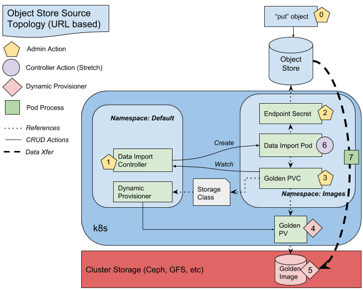

# Containerized Data Importer
This repo implements a fairly general file copier/importer. The importer, the controller which instantiates the importer,
and the associated Persistent Volume Claims (PVC) reside within a single, dedicated namespace (project) inside a Kubernetes
or Openshift cluster.

1. [Purpose](#purpose)
1. [Design](#design)
1. [Running the Data Importer](#running-the-data-importer)
1. [Getting Started For Developers](#getting-started-for-developers)

## Purpose

This project eases the burden on cluster admins seeking to take advantage
of Kubernetes/Openshift orchestration of their virtualized app platforms.
For the purposes of running a VM inside a container, the imported file referred to above
is a VM image and is considered to be an immutable _golden image_  source for subsequent
cloning and instantiation. As a first step in migration to a Kubernetes cluster, virtual machine
images must be imported into a location accessible to the kubelet. The Data Importer
automates this by copying images from an external http repository and persisting
them in in-cluster storage. The components of this process are detailed below.

## Design

The diagram below illustrates the architecture and control flow of this project.




### Work Flow
Steps are identified by role according the the colored shape. Each step must be performed in
the order they are number unless otherwise specified.

#### Assumptions

- (Optional) A "golden" namespace  which is restricted such that ordinary users cannot
create objects within it. This is to prevent a non-privileged user from trigger the import of a
 potentially large VM image.  In tire kicking setups, "default" is an acceptable namespace.

- (Required) A Kubernetes Storage Class which defines the storage provisioner. The "golden"
pvc expects dynamic provisioning to be enabled in the cluster.

#### Steps

0. An admin stores the data in a network accessible location outside of the Kubernetes cluster.

1. (Optional) If the source repo requires authentication credentials to access the source endpoint,
then the admin can create one or more secrets in the "golden" namespace, which contain
base64 encoded values of credentials.

2. The admin creates the Controller using a Deployment manifest provided in this repo.
The Deployment launches the controller in the "golden" namespace and ensures only one instance of the
controller is always running. This controller watches for PVCs containing special annotations which
define the source file's endpoint path, and secret name (if credentials are needed to access the
endpoint).

3. The admin creates the Golden PVC in the "golden" namespace. This PVC references the
Storage above, either explicitly or as the default. These "golden" PVCs, annotated per
below, tell the controller to create and launch the impoter pod which does the file copy.

4. The dynamic provisioner, referenced in the Storage Class, creates the Persistent Volume (PV) which
contains the target destination information.
5. (in parallel) The dynamic provisioner provisions the backing storage/volume, which for VM images, should
support fast cloning. Note: for VM images there is a one-to-one mapping of a volume to a single image. Thus,
each VM image has one PVC and one PV defining it.
6. (obsolete)
7. The Data Import Pod, created by the controller, mounts the Secret and the backend storage volume.
8. The importer pod copies the source file/image by streaming data from object store to the Golden Image
location via the mounted PV. When the copy completes the importer pod terminates. The destination file/image
name is always _disk.img_ but, since there is one volume per image file, the parent directory will (and must) differ.

**Note** the diagram above needs some revisions. 1) the "golden" namespace in the diagram is named _images_.
However, the diagram shows the controller in a different namespace. This is incorrect and will be revised.
The controller, pvc, secret and importer pod all live in the same "golden" namespace. 2) there is no ephemeral
secret. Each endpoint has a long lived secret in the "golden" namespace. The access and secret keys in these
secrets are consumed by the importer pod and passed to the endpoint for authentication.


### Components

**Data Import Controller:** Long-lived Controller pod in "golden" namespace.
The controller scans for "golden" PVCs in the same namespace looking for specific
annotations:
   kubevirt.io/storage.import.endpoint:  Defined by the admin: the full endpoint URI for
   the source file/image
   kubevirt.io/storage.import.secretName: Defined by the admin: the name of the existing
   Secret containing the credential to access the endoint.
   kubevirt.io/storage.import.status: Added by the controller: the current status of the
   PVC with respect to the import/copy process. Values include:
      ”In process”, “Success” ,“ Failed”

On detecting a new PVC with the endpoint annotation (and lacking the status annotation), the
controller creates the Data Importer pod "golden" namespace. The controller performs clean up
operations after the data import process ends.

**Data Import Pod:** Short-lived pod in "golden" namespace. The pod is created by the
controller and consumes the secret (if any) and the endpoint annotated in the PVC. It
copies the object referenced by the PVC's endpoint annotation to the destination directory
used by the storage class/provider. In all cases the target file **name** is _disk.img_.

**Dynamic Provisioner:** Existing storage provisoner(s) which create
the Golden Persistent Volume that reference an empty cluster storage volume.
Creation begins automatically when the Golden PVC is created by an admin.

**Endpoint Secret:** Long-lived secret in "golden" namespace that is defined and
created by the admin. The Secret must contain the access key id and secret key required
to make requests from the object store. The Secret is mounted by the Data Import pod.

**"Golden" Namespace:** Restricted/private Namespace for Golden PVCs and endpoint Secrets
Also the namespace where the CDI Controller and CDI Importer pods run.

**Golden PV:** Long-lived Persistent Volume created by the Dynamic Provisioner and
written to by the Data Import Pod.  References the Golden Image volume in storage.

**Golden PVC:** Long-lived Persistent Volume Claim manually created by an admin in the
"golden" namespace. Linked to the Dynamic Provisioner via a reference to the storage class
and automatically bound to a dynamically created Golden PV. The "default" provisioner and
storage class is used in the example; however, the importer pod supports any dynamic provisioner
which supports mountable volumes.

**Object Store:** Arbitrary url-based storage location.  Currently we support
http and S3 protocols.

**Storage Class:** Long-lived, default Storage Class which links Persistent
Volume Claims to the desired Dynamic Provisioner(s). Referenced by the golden PVC.
The example makes use of the "default" provisioner; however, any provisioner that
manages mountable volumes is compatible.


## Running the Data Importer

Deploying the controller and importer pod fairly simple but requires several manual steps. An admin
is expected to deploy the following object using `kubectl`. If the admin's current context is outside
of the "golden" namespace then she is expected to use the `--namespace=<name>` kubectl flag:
1. "golden" namespace where the controller, importer, secret(s) and PVC(s) live.
1. secret(s) containing endpoint credentials. Not required if the endpoint(s) are public.
1. storage class(es) defining the backend storage provisioner(s).
1. controller pod via the Deployment template. Note that the controller pod spec needs to set an
environment variable named OWN_NAMESPACE which can be done as:
```
...
   imagePullPolicy: Always
       env:
         - name: OWN_NAMESPACE
           valueFrom:
             fieldRef:
               fieldPath: metadata.namespace
```

### Assumptions
- A running Kubernetes cluster
- A reachable object store
- A file in the object store to be imported.

### Configuration

Make copies of the [example manifests](./manifests/importer) to some local directory for editing.  There are
several values required by the data importer pod that are provided by the configMap and secret.

The files needed are:
- cdi-controller-pod.yaml
- endpoint-secret.yaml
- golden-pvc.yaml

#### cdi-controller-pod.yaml
(to be replaced by a Deployment manifest)

Defines the spec used by the controller. There should be nothing to edit in this file unless
the "golden" namespace is desired to be hard-coded.
Note: no namespace is supplied since the controller is excpected to be created from the "golden" namespace.

#### endpoint-secret.yaml

One or more endpoint secrets in the "golden" namespace are required for non-public endpoints. If the
endpoint is public there is no need to an endpoint secret. No namespace is supplied since the secret
is excpected to be created from the "golden" namespace.
##### Edit:
- `metadata.name:` change this to a different secert name if desired. Remember to use this name in the
PVC's secret annotation.
-  `accessKeyId:` to contain the endpoint's key and/or user name. This value must be **base64** encoded
with no extraneous linefeeds. Use `echo -n "xyzzy" | base64` or `printf "xyzzy" | base64` to avoid a
trailing linefeed.
-  `secretKey:`  the endpoint's secret or password, again base64 encoded.
The credentials provided here
are consumed by the S3 client inside the pod.
> NOTE: the access key id and secret key **must** be base64 encoded without newlines (\n).

#### golden-pvc.yaml

This is the template PVC. No namespace is supplied since the PVC is excpected to be created from the
"golden" namespace. A storage class is also not provided since there is excpected to be a default
storage class per cluster. A storage class will need to be added if the default storage provider does
not met the needs of golden images. For example, when copying VM image files, the backend storage
should support fast-cloning, and thus a non-default storage class may be needed.
##### Edit:
-  `storageClassName:` change this to the desired storage class for high speed cloning.
-  `kubevirt.io/storage.import.endpoint:` change this to contain the source endpoint. Format:
   (http||s3)://www.myUrl.com/path/of/data
-  `kubevirt.io/storage.import.secretName:` (not needed for public endpoints). Edit the name of the
    secret containing credentials for the supplied endpoint.

### Deploy the API Objects

. First, create the "golden" namespace:  (no manifests are provided)

. Next, create one or more storage classes: (no manifests are provided).

. Next, create the endpoint secrets:
`kubectl create -f endpoint-secret.yaml`

. Next, create the cdi controller:
`kubectl create -f cdi-controller-pod.yaml`

. Next, create the persistent volume claim to trigger the import process;
`# kubectl create -f golden-pvc.yaml`

. Monitor the cdi-controller:
`kubectl logs cdi-controller`

. Monitor the importer pod:
`kubectl logs <unique-name-of-importer pod>`  # shown in controller log above

## Getting Started For Developers

See the readme under the _hack/_ directory.

TODO: move text below to _hack/_
### Download source:

`# in github fork kubevirt/containerized-data-importer to your personal repo`, then:
```
cd $GOPATH/src/
mkdir -p github.com/kubevirt/containerized-data-importer
go get github.com/kubevirt/containerized-data-importer
cd github.com/kubevirt/containerized-data-importer
git remote set-url origin <url-to-your-personal-repo>
git push origin master -f
```

 or

 ```
 cd $GOPATH/src/
 mkdir -p github.com/kubevirt && cd github.com/kubevirt
 git clone <your-forked-containerized-data-importer-url>
 cd containerized-data-importer
 git remote add upstream 	https://github.com/kubevirt/containerized-data-importer.git
 ```

### Use glide to handle vendoring of dependencies:

Install glide:

`curl https://glide.sh/get | sh`

Then run it from the repo root

`glide install -v`

`glide install` scans imports and resolves missing and unsued dependencies.
`-v` removes nested vendor and Godeps/_workspace directories.

### Create importer image from source:

```
cd $GOPATH/src/github.com/kubevirt/containerized-data-importer
make importer
```
which places the binary in _./bin/importer_.
The importer image is pushed to `jcoperh/importer:latest`,
and this is where the importer pod pulls the image from.

### Create controller image from source:

```
cd $GOPATH/src/github.com/kubevirt/containerized-data-importer
make controller
```
which places the binary in _./bin/importer-controller_.
The controller image is pushed to `jcoperh/importer-controller:latest`,
and this is where the controller pod pulls the image from.

> NOTE: when running the controller in a `local-up-cluster` environment (and in the default namespace)
the cluster role binding below was needed to allow the controller pod to list PVCs:
```
kubectl create clusterrolebinding cdi-controller --clusterrole=cluster-admin --serviceaccount=default:default
```

### S3-compatible client setup:

#### AWS S3 cli
$HOME/.aws/credentials
```
[default]
aws_access_key_id = <your-access-key>
aws_secret_access_key = <your-secret>
```

#### Mino cli

$HOME/.mc/config.json:
```
{
        "version": "8",
        "hosts": {
                "s3": {
                        "url": "https://s3.amazonaws.com",
                        "accessKey": "<your-access-key>",
                        "secretKey": "<your-secret>",
                        "api": "S3v4"
                }
        }
}
```
