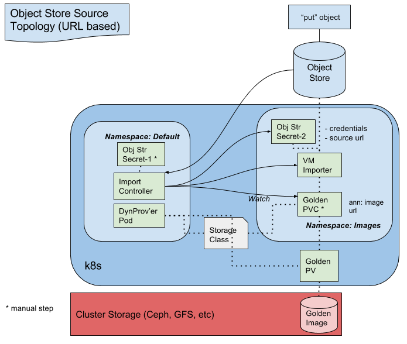

# VM Importer Design

## Purpose

The project eases the burden on cluster admins seeking to take advantage
of Kubernetes orchestration for their virtualized app platforms.  As a first
step in migration into a Kubernetes cluster, virtual machine images must
be imported into a location accessible to the kubelet.  The VM Importer
automates this by pulling images from an external http repository and preserving
them in in-cluster storage.  The components of this process are detailed below.

## Components:
**Dynamic Provisioner:** Existing storage provisoner(s) which create
the golden PV as a new (empty) volume. Note: we do not want to modify
any dynamic storage provisioners in order to support this solution.

**Golden PV:** Long-lived pv created by the dynamic provisioner and
populated by the copy pod..  References the golden Image.

**Golden PVC:** Long-lived claim manually created in the image NS.
References storage class which defines dynamic storage provisioner.
PVC annotation necessary for image controller’s pvc watch. Will be
automatically bound to the golden PV.

**Import Controller:** Long-lived controller pod in default namespace.
Scans for bound golden PVCs, in images ns, with identifier annotation.
Creates vm importer pod & object store secret in images ns.

**Namespace Images:** Restricted/private namespace for golden PVCs.
VM importer pod and it’s object store secret reside in this ns.

**Object Store:** Somewhat arbitrary url-based storage location.
We’re looking at glance and/or s3.

**Object Store Secret-1:** Long-lived, manually created, secret, in
default ns, Contains object store credentials.

**Object Store Secret-2:** Short-lived secret, in images ns, created
by the imager controller and consumed by the copier pod. Contains object
store credentials and full url to access a single image object.

**Storage Class:** Long-lived, manually created storage class defining
the dynamic provisioner(s). Referenced by the golden PVC. Does not
contain custom parameters.

**VM Importer:** Short-lived pod in images ns, created by the import
controller, which copies the source vm image to the storage defined by
the golden pv. VM image source url and credentials are obtained from
the object store secret-2.  Go binary baked into container performs
copy operation from source to golden pv.